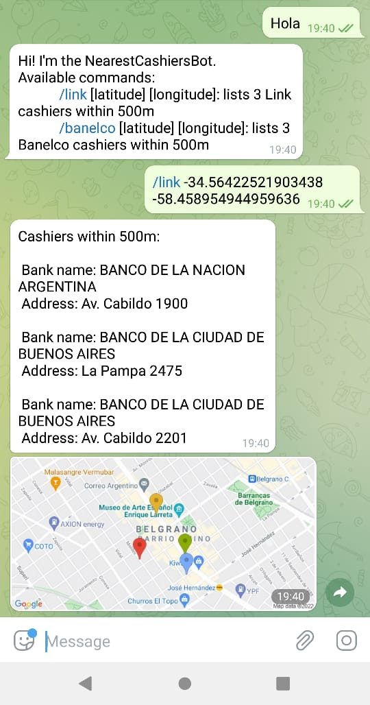
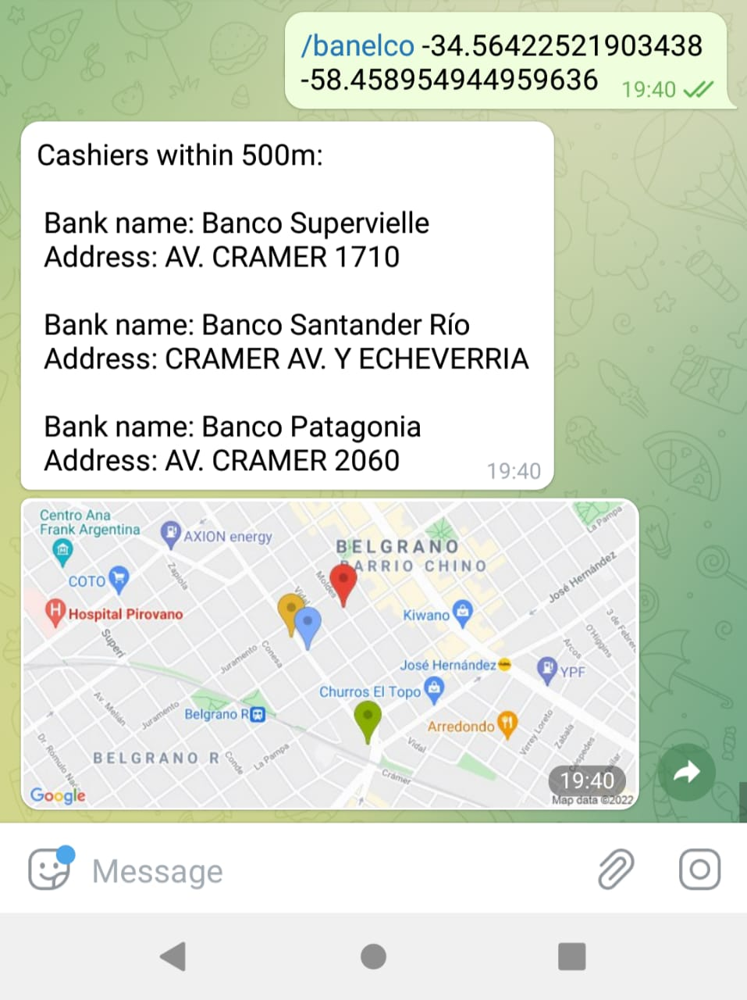

# NearestCashiersBot

Telegram bot that sends 3 cashiers within 500m from your current location(you must send your location using lat & long coordinates). It gets the cashiers in constant time using 'geohashes'.

Geohash: https://en.wikipedia.org/wiki/Geohash

Technologies: Python, PostgreSQL, Heroku

## Bot Screenshots  

## Requirements:

python3.76+ version

### Libraries:

pip install python-telegram-bot

pip install geolib

